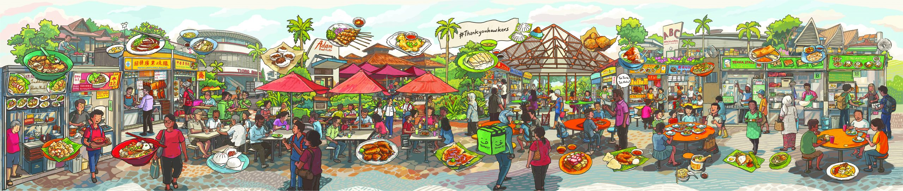

<h1 align="center"> Hawker Portal 🍴</h1> <br>
<p align="center">
  
</p>
<p align="center">

</p>

## Table of Contents

- [📝 Overview](#-overview)
- [💻 Tech Stack](#-tech-stack)
- [⚙️ Installation](#%EF%B8%8F-installation)
- [🎯 Application Usage](#-application-usage)
- [📷 Screenshots ](#-screenshots)
- [🌚 Contributors](#-contributors)


## 📝 Overview

### Current Issue: Hawker Users 👨‍🍳

The process of starting a hawker business is currently very inconvenient and inefficient. There is no existing platform to aid them to find a suitable spot to set up shop. Furthermore, potential hawkers need to travel to the National Environment Agency (NEA) customer centre to submit relevant documents such as the tender form to gain approval.

### Current Issue: NEA Agents 👨‍💼

NEA agents have to manually process the tender form since prospective hawkers are required to submit their tender forms physically. After which, a letter will be mailed to the prospective hawker if his/her bid has been accepted.

### Solution 💡

We have created a centralised platform which can:

<ul>
  <li>Help potential hawkers search for a suitable stall location.</li>
  <li>Help potential hawkers submit and track stall tender application status</li>
  <li>Allow NEA Agents to review tender applications and accept/reject them</li>
</ul>


## 💻 Tech Stack

    


## ⚙️ Installation

### Project setup

```
npm install
```

### Compiles and hot-reloads for development

```
npm run serve
```

### Compiles and minifies for production

```
npm run build
```

### Lints and fixes files

```
npm run lint
```


## 🎯 Application Usage

### Hawker Users 👨‍🍳

<ul>
  <li>Explore Hawker Centres around Singapore based on a wide range of filters!
    <ul>
      <li>Region</li>
      <li>Price</li>
      <li>Monthly Budget</li>
      <li>Hawker Centre Opening Hours</li>
      <li>Food Type</li>
      <li>Stall Availability</li>
    </ul>
  </li>
  <li>Track Hawker Stall Tender Applications in Real Time!</li>
  <li>Submit Hawker Stall Tender Applications with Ease!</li>
</ul>

### NEA Agents 👨‍💼

<ul>
  <li>Accept or Reject Hawker Stall Tenders in Real Time and with Ease!</li>
</ul>

## 📷 Screenshots

### Hawker Users 👨‍🍳

##### Login Page


<br/>
<br/>

##### Hawker Explore Page


<br/>
<br/>

##### Hawker Dashboard Page


<br/>
<br/>

##### Tender Application Page


<br/>
<br/>

##### Tender Application Page


<br/>
<br/>

### NEA Agents 👨‍💼

##### NEA Dashboard Page


<br/>
<br/>


## 🌚 Contributors

<a href="https://github.com/Buwoo/BT3103-Grp8/graphs/contributors">
  
</a>
